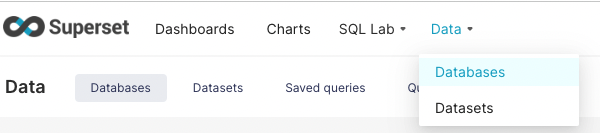
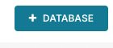
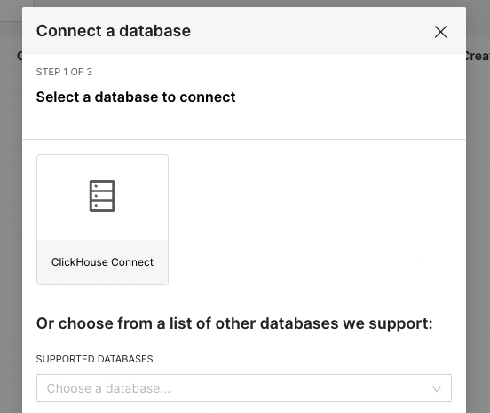
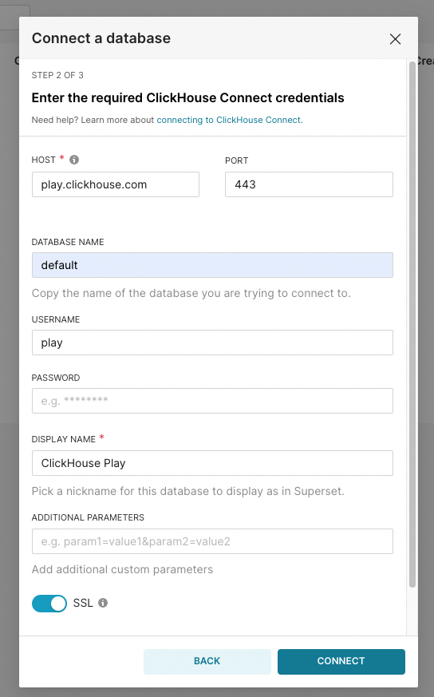
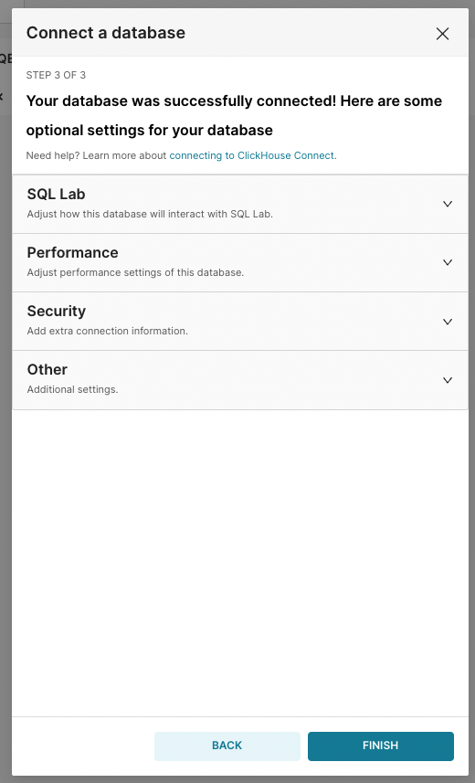

### Connecting to Superset

Follow the instructions for installing Apache Superset from the official documentation:
https://superset.apache.org/docs/intro.  

Install the ClickHouse Connect package by running `python setup.py install` from the
ClickHouse Connect Github project directory.

Start or restart Apache Superset after the clickhouse-connect package is available in
your Python installation.  ClickHouse Connect will automatically register the required
SQLAlchemy and Superset entry points.

Once logged into Superset, activate the Databases tab:

From the Databases tab, click the "Add Database" button:

The Superset new Database Dialog appears:

ClickHouse Connect has an advanced, custom wizard for connecting to your ClickHouse server.
(Other database options may be visible depending on your Python installation and Superset
configuration.)

Click on the `ClickHouse Connect` icon to start the database configuration wizard:

Configure the options for your own ClickHouse server, including the host name, port, user,
and SSL toggle for HTTPS connections.  The connection options shown will connect to the
ClickHouse official "Play" server.  Once the connection parameters have been provided,
click the `Connect` button for the next page of the wizard.

From this dialog page you can configure additional Superset options.  When finished, click the
`Finish` button and interfact with ClickHouse much like any other Superset data source.

